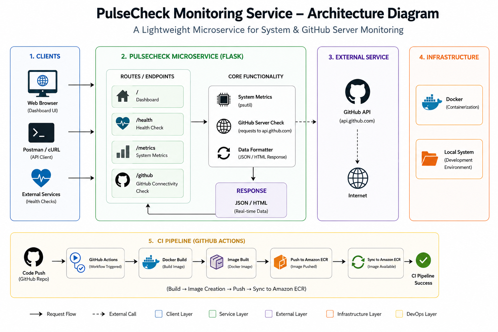
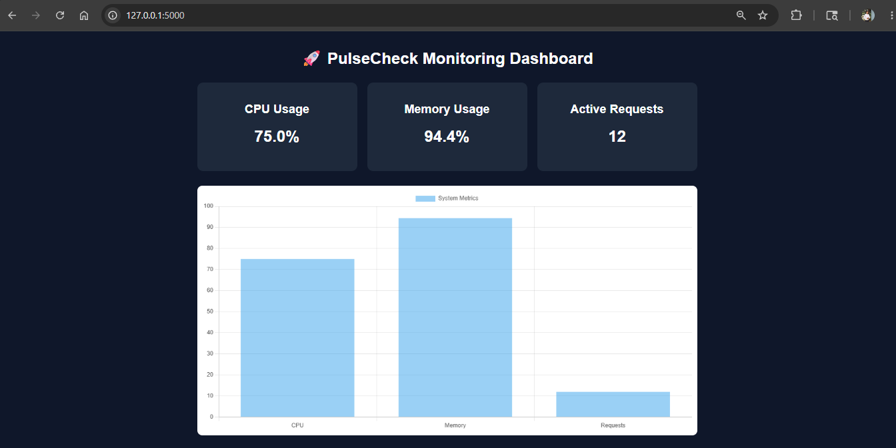
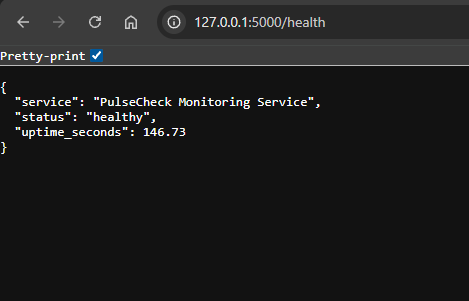
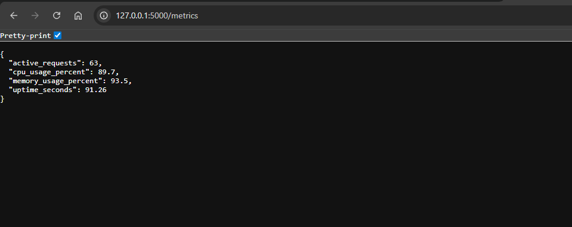
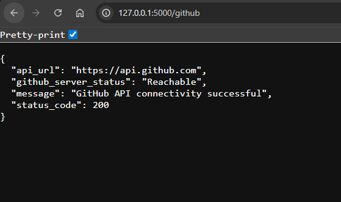
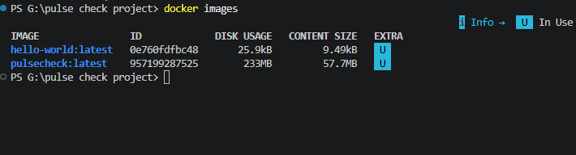
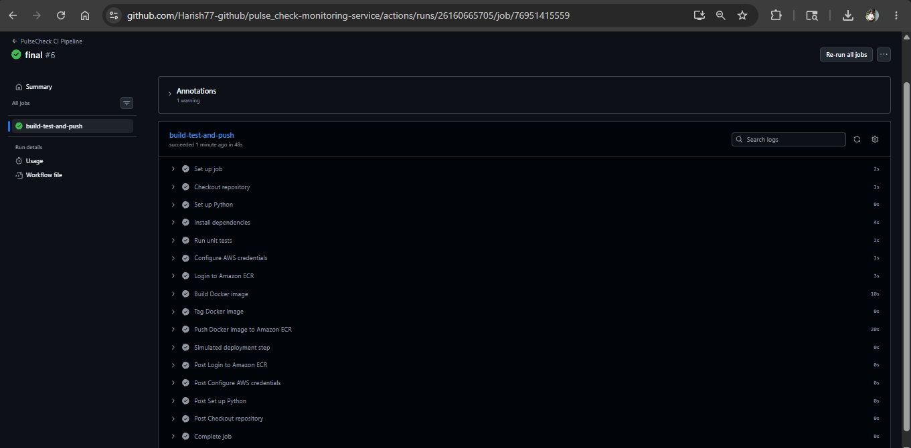
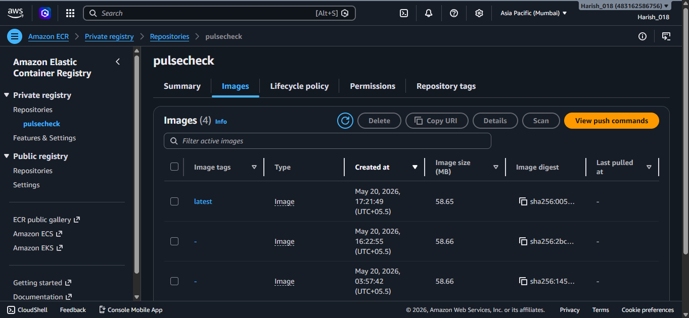

# 🚀 PulseCheck Monitoring Service

## 📖 Project Overview

PulseCheck Monitoring Service is a lightweight Flask-based monitoring microservice designed to demonstrate modern DevOps, CI/CD, Docker, and cloud integration workflows.

The project provides:

* Real-time system monitoring
* Health monitoring APIs
* GitHub connectivity monitoring
* Docker containerization
* Automated CI/CD using GitHub Actions
* Amazon ECR image synchronization

This project was built as a cloud-native microservice showcase focusing on automation, monitoring, and deployment workflows.

---

# ✨ Features

* ✅ Flask-based lightweight monitoring microservice
* ✅ Interactive monitoring dashboard
* ✅ Health monitoring endpoint
* ✅ System metrics monitoring endpoint
* ✅ GitHub API connectivity monitoring
* ✅ Docker containerization support
* ✅ GitHub Actions CI/CD pipeline
* ✅ Automated Docker image build workflow
* ✅ REST API architecture

---

# 🏗️ Architecture Diagram



The architecture follows a lightweight local-first cloud-integrated workflow:

```text
Developer
   ↓
GitHub Repository
   ↓
GitHub Actions CI Pipeline
   ↓
Run Unit Tests
   ↓
Build Docker Image
   ↓
Push Docker Image to Amazon ECR
   ↓
CloudFormation Infrastructure Templates
```

### Included in Current Implementation

* Flask monitoring microservice
* REST API endpoints
* Docker containerization
* GitHub Actions CI pipeline
* CloudFormation IaC templates
* Local monitoring dashboard

### Explored / Attempted

* AWS ECS Fargate deployment
* ECS service provisioning using CloudFormation

> Note: ECS deployment templates were implemented and tested as part of the infrastructure automation workflow, but the project demonstration primarily focuses on the successful CI/CD pipeline, Docker containerization, ECR integration, and local monitoring service execution.

---

# 🛠️ Tech Stack

| Technology         | Purpose                      |
| ------------------ | ---------------------------- |
| Python             | Backend programming language |
| Flask              | REST API framework           |
| Docker             | Containerization             |
| GitHub Actions     | CI/CD automation             |
| Amazon ECR         | Docker image registry        |
| AWS CloudFormation | Infrastructure-as-Code       |
| Pytest             | Unit testing                 |
| psutil             | System metrics monitoring    |

---

# 📂 Project Structure

```text
pulsecheck-monitoring-service/
│
├── .github/
│   └── workflows/
│       └── ci.yaml
│
├── infrastructure/
│   └── ecs-stack.yml
│
├── screenshots/
│
├── app.py
├── requirements.txt
├── Dockerfile
├── README.md
└── test_app.py
```

---

# 🔌 API Endpoints

| Endpoint   | Description                        |
| ---------- | ---------------------------------- |
| `/`        | Monitoring dashboard               |
| `/health`  | Service health status              |
| `/metrics` | CPU and memory metrics             |
| `/github`  | GitHub API connectivity monitoring |

---

# 🐳 Docker Setup

## Build Docker Image

```bash
docker build -t pulsecheck .
```

## Run Docker Container

```bash
docker run -p 5000:5000 pulsecheck
```

## Verify Running Containers

```bash
docker ps
```

## View Docker Images

```bash
docker images
```

---

# ⚙️ CI/CD Pipeline

The project uses GitHub Actions for Continuous Integration and deployment automation.

## Pipeline Workflow

```text
Git Push
   ↓
GitHub Actions Trigger
   ↓
Run Unit Tests
   ↓
Build Docker Image
   ↓
Push Docker Image to Amazon ECR
   ↓
Simulated Deployment Step
```

## CI/CD Features

* Automatic workflow trigger on push
* Automated unit testing using Pytest
* Docker image build automation
* Amazon ECR image synchronization
* Deployment simulation stage

---

# ☁️ AWS Integration

The project integrates with AWS cloud services including:

* Amazon ECR for Docker image storage
* AWS CloudFormation for Infrastructure-as-Code templates

## Amazon ECR Integration

Docker images are automatically pushed to:

```text
483162586756.dkr.ecr.ap-south-1.amazonaws.com/pulsecheck
```

## ECS Infrastructure Exploration

AWS CloudFormation templates were created to model ECS Fargate infrastructure using Infrastructure-as-Code (IaC) principles.

The templates include configurations for:

- ECS Cluster setup
- ECS Task Definitions
- ECS Service architecture
- Networking and subnet configuration
- Security group integration

This implementation was designed to demonstrate cloud-native deployment architecture and infrastructure automation workflows using AWS services.

---

# 🧱 Infrastructure-as-Code (IaC)

Infrastructure templates were developed using AWS CloudFormation to demonstrate automated cloud resource provisioning concepts.

The templates define foundational ECS infrastructure components and deployment architecture required for containerized microservice environments.

CloudFormation template location:

```text
infrastructure/ecs-stack.yml
CloudFormation template location:

```text
infrastructure/ecs-stack.yml
```

---

# 🧪 Running the Application Locally

## Install Dependencies

```bash
pip install -r requirements.txt
```

## Start Flask Application

```bash
python app.py
```

## Access Local Dashboard

```text
http://localhost:5000
```

---

# 📸 Screenshots

## Monitoring Dashboard



## Health Endpoint



## Metrics Endpoint



## GitHub Connectivity Monitoring Endpoint



## Docker Images




## GitHub Actions CI Pipeline



## Amazon ECR Repository




---

# 🚀 Future Improvements

* ECS automatic deployment integration
* Real-time monitoring alerts
* Load balancing support
* Kubernetes deployment
* Production-grade monitoring stack

---

# 👨‍💻 Author

Harish

---

# 📜 License

This project was developed for educational and demonstration purposes.
